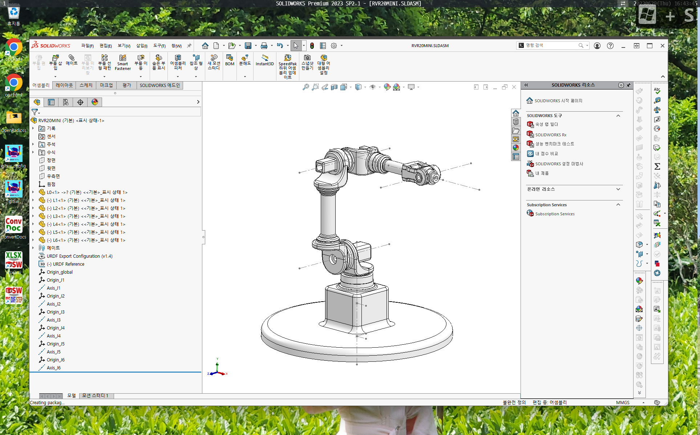

# EX_DH-PARAMETER

_Example of DH-Parameter_

## Softwares
* Solidworks
* [URDF Exporter Add-in](http://wiki.ros.org/sw_urdf_exporter)

## How to use
* [Youtube - Making URDF in Solidworks](https://youtu.be/c8ZtnFeyjQw)

## Check
* https://gkjohnson.github.io/urdf-loaders/javascript/example/bundle/
* Drag Output folder and Drop into the web page.
* [Youtube - Check  URDF](https://youtu.be/YzDghNxW8A4)
